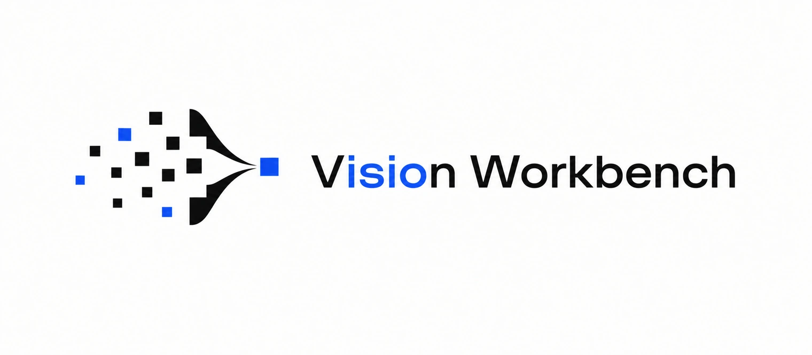

<h1 align="center">
  
</h1>

<p align="center">
  <a href="./README.en.md">English</a>
  ·
  <a href="./docs/README.md">文档中心</a>
  ·
  <a href="./docs/二次开发指南.md">二次开发指南</a>
  ·
  <a href="./docs/legal/发布策略.md">发布策略</a>
  ·
  <a href="./SECURITY.md">安全策略</a>
  ·
  <a href="./CHANGELOG.md">更新日志</a>
  ·
  <a href="./THIRD_PARTY_NOTICES.md">第三方引用说明</a>
</p>

<p align="center">
  
  
  
  
  
</p>

Vision Workbench 是一个本地计算机视觉学习工作台，当前以统一 PySide6 / Qt 桌面界面为准。项目把传统图像处理、全景重构、相机诊断、图像分类、YOLO26 目标检测、YOLO26 分割和 YOLO26 训练统一放在 `vision-workbench` 主入口中。

它不是零散脚本集合，而是一条完整学习链路：对外 Python API、Qt 桌面主界面、模型与数据集目录、自动化测试、打包配置、开源许可证和第三方引用说明都已经放在工程里。

## 项目生态

<p align="center">
  
</p>

## 功能模块

| 模块            | 功能定位                                                           | 文档                                            |
| --------------- | ------------------------------------------------------------------ | ----------------------------------------------- |
| 基础 CV         | OpenCV 基础图像处理、色彩空间、通道分离、直方图、形态学与几何变换  | [README](./docs/modules/zh-CN/基础CV.md)         |
| 全景重构        | 左右图像拼接、SIFT 匹配、人工点选、辅助点选和全景输出              | [README](./docs/modules/zh-CN/全景重构.md)       |
| 相机诊断        | 摄像头检测、读取模式测试、实时预览、FPS、截图与录屏                | [README](./docs/modules/zh-CN/相机诊断.md)       |
| 图像分类        | ResNet18、MobileNetV3 Small 预测、预训练权重、数据集校验和基础训练 | [README](./docs/modules/zh-CN/图像分类.md)       |
| YOLO26 目标检测 | YOLO26 模型加载、图片检测、摄像头实时推理、截图和下载              | [README](./docs/modules/zh-CN/YOLO26目标检测.md) |
| YOLO26 分割     | YOLO26 实例分割和语义分割，支持图片输入                            | [README](./docs/modules/zh-CN/YOLO26分割.md)     |
| YOLO26 训练     | 检测、实例分割、语义分割训练入口与数据集校验                       | [README](./docs/modules/zh-CN/YOLO26训练.md)     |

## 快速开始

环境要求：

- Python 3.10 或更新版本，默认推荐 Python 3.11。
- Conda 或其它隔离 Python 环境。
- 本地项目源码目录。

创建基础环境，使用 editable 模式安装项目，然后启动桌面应用：

```bash
conda create -n vision-workbench python=3.11 -y
conda activate vision-workbench
cd path/to/vision-workbench
pip install -e .
vision-workbench
```

首次启动会打开统一 Qt 桌面主界面。左侧导航直接进入基础 CV、全景重构、相机诊断、YOLO 检测、YOLO 分割、模型训练、图像分类和版本信息。版本页面读取实际运行代码的版本，并可在不阻塞启动的前提下查询 GitHub 官方稳定版本。

第一次接触训练时，可在“模型训练”或“图像分类 → 训练”中点击“创建示例数据”，再点击“检查训练环境”和“应用推荐批量”。示例数据只用于跑通流程，不用于评估模型效果。训练期间可查看轮次、损失和验证准确率，并可安全停止独立训练进程。

图像分类预测或训练需要先安装分类依赖组：

```bash
python scripts/install_dependencies.py classification
vision-workbench
```

YOLO26 检测、分割和训练需要先安装 YOLO26 依赖组：

```bash
python scripts/install_dependencies.py yolo26
vision-workbench
```

可选依赖安装完成后执行依赖诊断：

```bash
python scripts/install_dependencies.py doctor
```

基础安装保持轻量，深度学习能力单独启用，便于先打开桌面界面并跑通基础功能。

## 问题排查

安装命令失败、GUI 弹窗报错、摄像头流程异常、模型加载失败、数据集校验失败和训练失败统一从 [问题排查指南](./docs/troubleshooting/zh-CN/问题排查指南.md) 开始定位。用户可见错误提示也会附带对应的排查文档路径。

异常退出后残留的 GUI、摄像头或训练进程可用 `python scripts/cleanup_runtime.py` 列出。确认 dry-run 列表后，使用 `python scripts/cleanup_runtime.py --kill` 清理匹配的项目进程。

## 安全与版本记录

疑似安全漏洞通过 [SECURITY.md](./SECURITY.md) 中的私密渠道报告。公开 issue 中不发布利用细节或敏感环境信息。

`.pt` / `.pth` 模型属于可执行序列化格式。程序默认启用受限模型加载并校验可用的下载哈希，但仍只应加载
仓库内置、上游官方或来自可信人员的模型文件。不要把未知 checkpoint 当作普通图片文件打开。

版本变动维护在 [CHANGELOG.md](./CHANGELOG.md)。

跨平台、键盘、屏幕阅读器和不同显卡的发布前人工检查项见 [QA 检查清单](./docs/qa-checklist.md)。

## 发布包说明

Git 仓库是完整项目源码的正式载体，保存第一方源码、测试、正式文档、辅助脚本、项目元数据、许可文件、符合仓库策略的模型资产和内置第三方源码。`dist/` 等本地构建产物不提交到源码仓库。

正式版本建议通过 [GitHub Releases](https://github.com/ksukie/Vision-WorkBench/releases) 发布。基础打包版本可通过 wheel 文件本地安装：

```bash
pip install vision_workbench-1.0.2-py3-none-any.whl
vision-workbench
```

wheel 是轻量 Python 安装包，会安装第一方 Python 包、必要资源和入口命令。它不是 Git 仓库的完整副本，也不是完整离线运行环境：测试、开发脚本、完整第三方源码、大型模型权重和可选深度学习依赖可以不包含在 wheel 中。完整源码以对应版本的 Git tag 或源码归档为准。

官方 `Vision-Workbench-win-x64.exe` 是自包含的 Windows 基础应用，不需要另装 Python，包含 Qt 主界面、基础 CV、全景重构、相机诊断和版本信息。图像分类与 YOLO 等重型工作流不进入该基础 EXE；对应导航页会引导用户使用版本匹配的完整源码环境。

### 版本身份与更新

程序内的“版本信息”页面是判断当前实际运行代码身份的用户入口，会同时展示运行版本、更新时间和运行方式（editable 源码、Python wheel 或 Windows 单文件 EXE）。程序启动时不会自动联网；只有点击“检查更新”后才查询官方 GitHub 的最新稳定 Release。仅当正式资产的版本和文件名精确匹配、HTTPS 地址受信任、大小未超限且具有完整 SHA-256 时，页面才允许一键安装。Python 更新还要求当前版本与目标版本的运行依赖契约完全一致；不满足时会保持禁用，并引导到 Release 页面手动更新。

wheel 或 editable 源码模式确认更新后，Qt 会先退出，独立更新助手再使用 `--no-deps` 安装已校验 wheel，并在重启前复核 pip 元数据、运行版本和安装模式。editable 模式只会改变当前 Python 环境的包注册，不会修改、重置或删除源码仓库。Windows 官方资产使用稳定文件名 `Vision-Workbench-win-x64.exe`，实际版本由内置身份和发布清单共同确定，因此原地更新不会留下带旧版本号的文件名。新文件会先复制到当前程序同目录并执行版本和 Qt 自检，再原子替换，同时保留上一版 EXE 备份。更新失败日志位于对应版本的更新缓存中；Windows 默认路径为 `%LOCALAPPDATA%\VisionWorkbench\updates\<version>\update.log`。

editable 安装的 `pip list` / `pip show` 元数据只在安装时生成，之后即使源码和 `pyproject.toml` 已更新也可能仍显示旧版本；此时 `vision-workbench.exe` 实际加载的是当前工作区源码。1.0.0 起，程序内版本页会按当前运行模式读取真实代码身份。需要同步 pip 元数据时可重新执行 `python -m pip install --no-deps --editable .`；正式使用建议安装对应版本 wheel。

源码归档、Python sdist、wheel 和模型 Release Assets 的正式边界见[发布策略](./docs/legal/发布策略.md)。

从源码构建：

```bash
conda activate vision-workbench
pip install build
python -m build
```

隔离构建环境无法访问 PyPI 时，改用当前环境构建：

```bash
python -m build --no-isolation
```

## 仓库结构

```text
VisionWorkbench/
  src/                         第一方 Python 源码
  src/vision_workbench/desktop/ 统一 PySide6 桌面主界面和页面
  docs/                        正式项目文档
  docs/assets/readme/          README 图片和图标
  models/                      仓库允许管理的模型资产
  scripts/                     安装、检查和维护脚本
  third_party/yolo26_source/   内置 YOLO26 源码
  tests/                       自动化测试
```

运行过程中还会使用以下本地工作目录。它们可能由程序或用户创建，不属于每个 Git 克隆都必须包含的固定源码结构：

```text
datasets/                    本地数据集
runs/                        训练输出
models/**/custom/            用户导入或训练得到的自定义模型
```

## 依赖策略

基础依赖覆盖 Qt 桌面主界面和传统 CV 功能：PySide6、NumPy、OpenCV 和 Pillow。

深度学习能力按需安装：

- 图像分类：`python scripts/install_dependencies.py classification`
- YOLO26 检测、分割与训练：`python scripts/install_dependencies.py yolo26`

安装脚本会检测 NVIDIA GPU；有 NVIDIA GPU 时安装 CUDA 12.6 Torch wheel，否则选择 CPU 或平台默认 Torch 构建。直接执行 `pip install -r requirements-*.txt` 无法自动检测 GPU，因此新环境优先使用安装脚本。安装源默认为官方 PyPI；如需受控镜像，可显式设置 `VISION_WORKBENCH_PYPI_INDEX`。

`requirements-base.lock` 固定基础 GUI 依赖及其哈希，CI 使用它进行可复现安装。`requirements-dev.txt` 固定测试、依赖审计和 SBOM 工具版本。

手动使用 `requirements-*.txt` 安装深度学习依赖后执行：

```bash
python scripts/install_dependencies.py doctor
```

这一路径保证基础功能先完成验证，再启用更重的深度学习功能。

## 架构说明

功能包根据职责使用 `api/`、`application/`、`domain/`、`infrastructure/`、`processing/`、`configuration/` 或 `ports/`。并非每个功能包都需要包含全部目录；没有对应职责时不创建空层。用户直接使用的桌面体验位于 `src/vision_workbench/desktop/`。旧 `*/window/` Tkinter 模块仅保留有限兼容和参考用途，不再作为公开 GUI 入口。具体边界见[旧版界面维护策略](./docs/旧版界面维护策略.md)。

## 开源许可

Vision Workbench 是面向学习和研究的开源项目，采用 AGPL-3.0 许可发布。详见 [LICENSE](./LICENSE)。

本项目在 `third_party/yolo26_source/` 内置了 Ultralytics YOLO26 源码。Vision Workbench 不是 Ultralytics 官方项目。YOLO26 源码和 YOLO26 模型权重仍然遵守 Ultralytics 原始许可条款。详见 [THIRD_PARTY_NOTICES.md](./THIRD_PARTY_NOTICES.md)。

## 致谢

2026.07.01 - 致谢 [@antique798](https://github.com/antique798) 协助测试 Vision Workbench 并反馈问题。
