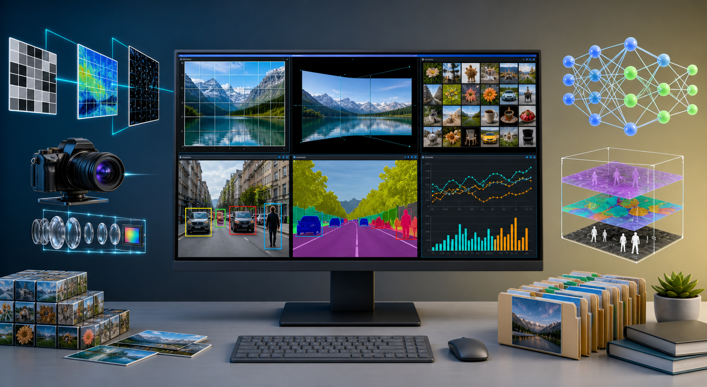
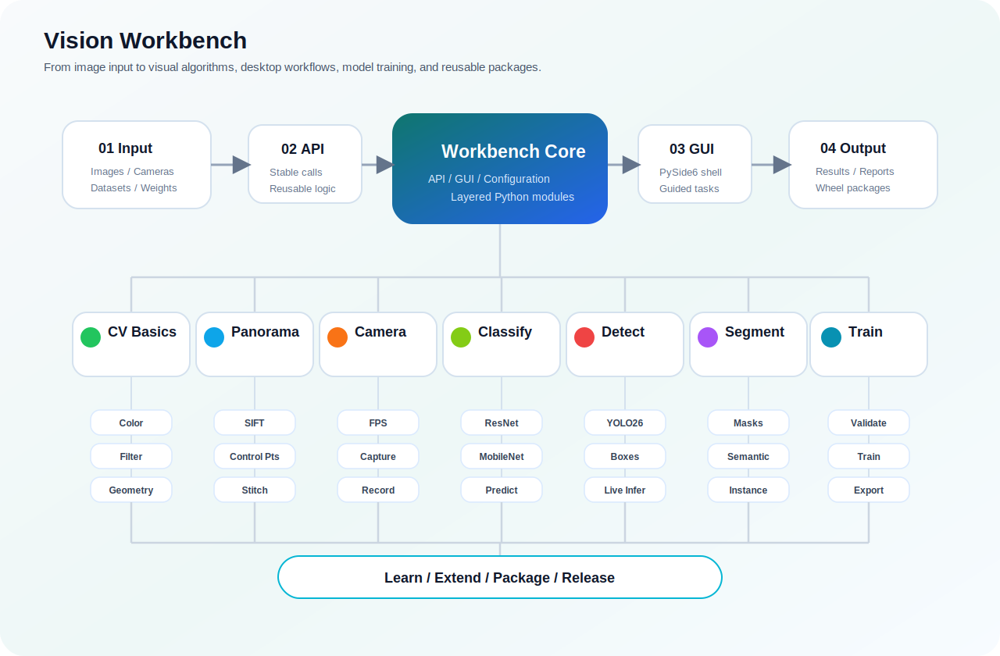

# Vision Workbench

<p align="center">
  
</p>

<p align="center">
  <a href="./README.md">English</a>
  ·
  <a href="./docs/adding_custom_features_README.zh-CN.md">二次开发指南</a>
  ·
  <a href="./docs/legal/release_policy.zh-CN.md">发布策略</a>
  ·
  <a href="./THIRD_PARTY_NOTICES.md">第三方引用说明</a>
</p>

<p align="center">
  
  
  
  
</p>

Vision Workbench 是一个本地计算机视觉学习工作台。项目把传统图像处理、全景重构、相机诊断、图像分类、YOLO26 目标检测、YOLO26 分割和 YOLO26 训练放在同一个新手友好的工程里。

它不是单个脚本集合，而是一个完整学习链路：对外 Python API、桌面 GUI、模型与数据集目录、自动化测试、打包配置、开源许可文件和第三方引用说明都已经放在工程中。

## 项目生态

<p align="center">
  
</p>

## 功能模块

| 模块            | 功能定位                                                           | 文档                                                                  |
| --------------- | ------------------------------------------------------------------ | --------------------------------------------------------------------- |
| 基础 CV         | OpenCV 基础图像处理、色彩空间、通道分离、直方图、形态学与几何变换  | [README](./docs/modules/zh-CN/cv_basics_README.zh-CN.md)               |
| 全景重构        | 左右图像重构、SIFT 匹配、人工点选、辅助点选和全景输出              | [README](./docs/modules/zh-CN/panorama_reconstruction_README.zh-CN.md) |
| 相机诊断        | 摄像头检测、读取模式测试、实时预览、FPS、截图与录屏                | [README](./docs/modules/zh-CN/camera_diagnostics_README.zh-CN.md)      |
| 图像分类        | ResNet18、MobileNetV3 Small 预测、预训练权重、数据集校验和基础训练 | [README](./docs/modules/zh-CN/image_classification_README.zh-CN.md)    |
| YOLO26 目标检测 | YOLO26 检测模型加载、摄像头实时推理、截图和录屏                    | [README](./docs/modules/zh-CN/yolo26_detection_README.zh-CN.md)        |
| YOLO26 分割     | YOLO26 实例分割和语义分割，支持图片和摄像头输入                    | [README](./docs/modules/zh-CN/yolo26_segmentation_README.zh-CN.md)     |
| YOLO26 训练     | 检测、实例分割、语义分割训练入口与数据集校验                       | [README](./docs/modules/zh-CN/yolo26_training_README.zh-CN.md)         |

## 快速开始

基础环境，适用于基础 CV、全景重构和相机诊断：

```bash
conda create -n vision-workbench python=3.11 -y
conda activate vision-workbench
cd path/to/vision-workbench
pip install -e .
vision-workbench
```

图像分类：

```bash
pip install -r requirements-classification.txt
image-classification-workbench
```

YOLO26 相关功能：

```bash
pip install -r requirements-yolo26.txt
yolo26-detection-workbench
```

## 发布包说明

本仓库只保存源码、文档、测试、配置和许可文件。`dist/` 目录属于本地构建产物，不建议提交到源码仓库。

正式版本建议通过 [GitHub Releases](https://github.com/ksukie/vision-workbench/releases) 发布。只想安装打包版本的用户，可以在 Release 页面下载 `.whl` 文件，然后本地安装：

```bash
pip install vision_workbench-0.1.0-py3-none-any.whl
vision-workbench
```

如果用户希望基于源码自己构建 wheel，可以执行：

```bash
conda activate vision-workbench
pip install build
python -m build
```

如果隔离构建环境无法访问 PyPI，可以改用当前环境构建：

```bash
python -m build --no-isolation
```

## 项目结构

```text
VisionWorkbench/
  src/                         源码目录
  docs/                        项目文档
  docs/assets/readme/          README 图片和图标
  models/                      模型权重目录
  datasets/                    数据集目录
  runs/                        训练输出目录
  third_party/yolo26_source/   内置 YOLO26 源码
  tests/                       自动化测试
```

## 依赖策略

基础依赖保持轻量，只包含 NumPy、OpenCV 和 Pillow。

深度学习能力按需安装：

- 图像分类：`requirements-classification.txt`
- YOLO26 检测、分割与训练：`requirements-yolo26.txt`

这样可以保证新手先用基础功能跑通项目，再根据需要启用更重的深度学习功能。

## 开源许可

Vision Workbench 是面向学习和研究的开源项目，采用 AGPL-3.0 许可发布。详见 [LICENSE](./LICENSE)。

本项目在 `third_party/yolo26_source/` 内置了 Ultralytics YOLO26 源码。Vision Workbench 不是 Ultralytics 官方项目。YOLO26 源码和 YOLO26 模型权重仍然遵守 Ultralytics 原始许可条款。详见 [THIRD_PARTY_NOTICES.md](./THIRD_PARTY_NOTICES.md)。
